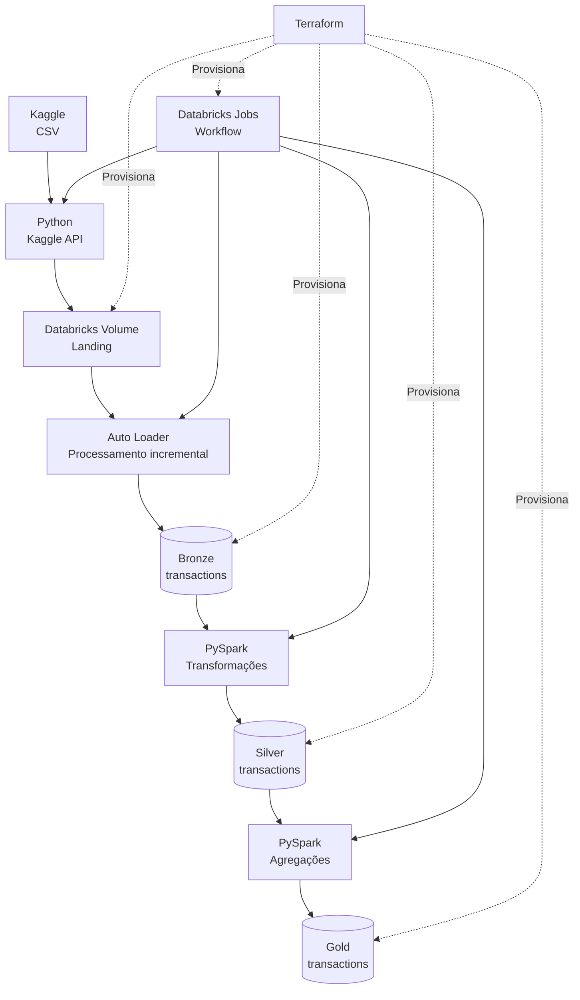
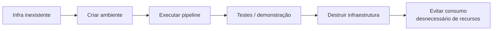

# Databricks Anti-Fraud Data Platform

Projeto **acadêmico** de Engenharia de Dados que implementa uma plataforma de processamento de transações de cartão de crédito com **Python, Databricks e Delta Lake**. Utiliza arquitetura **Lakehouse em camadas (Bronze → Silver → Gold)**, ingestão incremental com **Auto Loader**, transformações com **PySpark**, armazenamento em Databricks Volumes e orquestração com 
**Databricks Jobs**. Toda a infraestrutura é provisionada e gerenciada com Terraform.

> O foco principal está no pipeline dentro do **Databricks**. A infraestrutura é criada, testada e destruída.

## Arquitetura




| Etapa | Papel | Onde está no projeto |
|---|---|---|
| 🐍 **Python** | Consulta o Kaggle, baixa arquivos novos e envia para o Databricks | `src/upload.py` |
| 📥 **Kaggle** | Fonte dos CSVs de transações | `src/upload.py` |
| 📦 **Databricks Volumes** | Armazena os arquivos na camada Landing | `terraform/main.tf` |
| 🔄 **Auto Loader** | Ingestão incremental dos arquivos → Bronze | `src/bronze/ingest_transactions.py` |
| 🥉 **Bronze** | Dados brutos ingeridos + metadados | `src/bronze/ingest_transactions.py` |
| 🥈 **Silver** | Dados tratados, validados e tipados | `src/silver/transform_transactions.py` |
| 🥇 **Gold** | Agregações por banco/mês e métricas analíticas | `src/gold/aggregate_transactions.py` |
| ⚙️ **Databricks Jobs** | Orquestra as etapas `upload → bronze → silver → gold` | `terraform/main.tf` |
| 🏗️ **Terraform** | Provisiona e gerencia a infraestrutura do pipeline | `terraform/main.tf` |
| 🔐 **Secrets** | Armazena o token do Kaggle utilizado pelo Job | `terraform/main.tf` |


## Filosofia: criar, testar e destruir



Por ser um projeto acadêmico, o ambiente é criado rapidamente para uma demonstração e removido logo em seguida. Terraform e os scripts Python cuidam disso.

### Observacão

Este projeto foi configurado para funcionar em diferentes ambientes, permitindo sua execução tanto diretamente no **Windows** quanto através de um **Dev Container** (Linux).

## Configurando o Ambiente 

### No Dev Container:

No devcontainer todo o ambiente já esta configurado, você só precisa **configurar as credenciais no dotenv** necessárias para rodar e então realizar as configurações abaixo:

1. Pegar as variáveis do .env e colocá-las como variáveis de ambiente do terminal atual.

```bash
set -a
source .env
set +a
```

2. Verificar de forma segura se a variável KAGGLE_API_TOKEN existe e não está vazia sem mostrar o token.

```bash
echo ${KAGGLE_API_TOKEN:+CONFIGURADO}
```

3. Realizar uma cópia da variável KAGGLE_API_TOKEN para outra variável chamada TF_VAR_kaggle_api_token.

```bash
export TF_VAR_kaggle_api_token="$KAGGLE_API_TOKEN"
```

4. Verificar de forma segura se a variável TF_VAR_kaggle_api_token existe e não está vazia sem mostrar o token.

```bash
echo ${TF_VAR_kaggle_api_token:+CONFIGURADO}
```

### No Windows: 

1. Script PowerShell para Windows que lê o .env e transforma cada variável dele em uma variável de ambiente do Windows.

```bash
Get-Content .env | ForEach-Object {
     if ($_ -match '^([^#][^=]*)=(.*)$') {
         [System.Environment]::SetEnvironmentVariable($matches[1], $matches[2])
     }
 }
```

2. Realizar uma cópia da variável KAGGLE_API_TOKEN para outra variável chamada TF_VAR_kaggle_api_token.

```bash
$env:TF_VAR_kaggle_api_token = $env:KAGGLE_API_TOKEN
```


## Executando

1. Acessar a pasta terraform com:

```bash
cd terraform/
```

>Se for a primeira vez execute: (Ignore se não for a primeira vez)

```bash
terraform init 
```

2. Execute dentro da pasta terraform o comando:
```bash
terraform apply -auto-approve 
```

Após a execução do Terraform, o lab estará provisionado e disponível no Databricks. Para visualizar o pipeline em funcionamento, acesse **Jobs & Pipelines** e execute o Job `anti-fraud-pipeline`. O workflow irá consultar os dados disponíveis no Kaggle, realizar a ingestão e o processamento dos arquivos e, ao final, alimentar as camadas **Bronze, Silver e Gold**.


## Parte 6 - Destruição da infraestrutura

Ao final da execução, não esqueça de destruir todos os artefatos no databricks.
Para isso siga os passos abaixo:

1. Garanta que você esteja em /databricks-anti-fraud-data-platform (Para voltar pastas digite o comando `cd ..`)

2. Execute o cleanup.py
```bash
uv run python /cleanup.py  
```

3. Acesse a pasta terraform novamente com `cd terraform/` e digite o comando abaixo:
```bash
terraform destroy -auto-approve
```

Feito esses passos você não terá mais nenhum recurso provisionado no Databricks